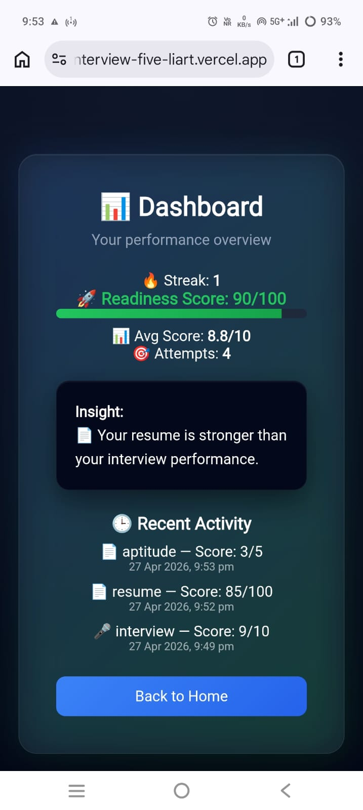
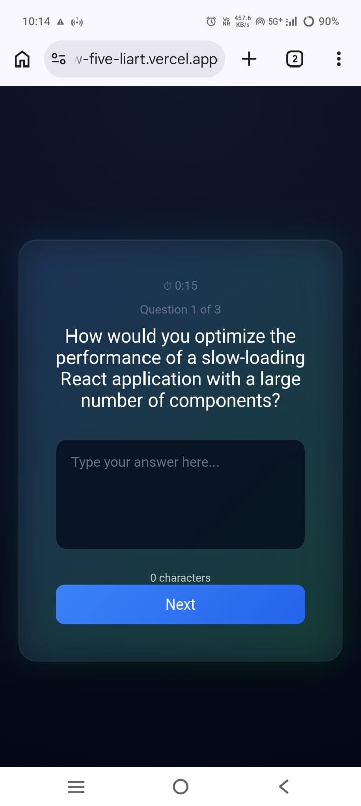
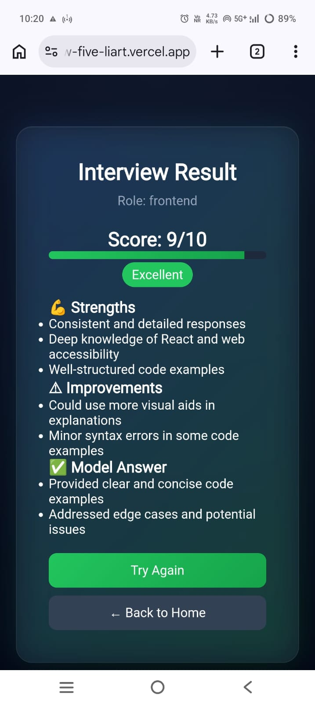
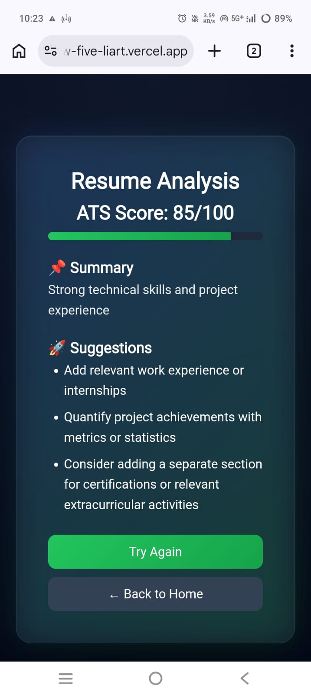
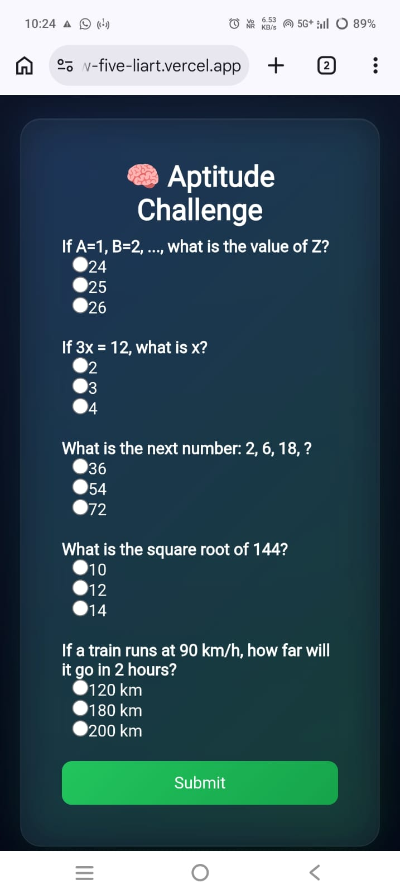

# 🚀 AI Placement Preparation Platform

A complete AI-powered platform designed to help students prepare for placements through **Interview Practice, Resume Analysis, Aptitude Testing, and Performance Tracking**.

---

## 📌 Problem Statement

Students preparing for placements struggle with:

- Lack of real interview practice
- Poor resume quality
- Weak aptitude skills
- No way to track overall readiness

This project solves all of these in **one integrated system**.

---

## 💡 Solution Overview

This platform provides:

- 🎤 AI Mock Interviews
- 📄 Resume Analyzer (ATS-based scoring)
- 🧠 Aptitude Practice Module
- 📊 Dashboard with Readiness Score
- 🔥 Streak & History Tracking

All modules are **connected**, giving users a **complete preparation system**.

---

## 🧩 Core Features

### 🎤 AI Mock Interview

- Role-based interviews (Frontend, Backend, HR)
- AI-generated questions using LLM
- Answer evaluation and scoring (/10)
- Feedback including:
  - Strengths
  - Improvements
  - Model answers

---

### 📄 Resume Analyzer

- Upload resume details
- AI analyzes and gives:
  - ATS Score (/100)
  - Summary
  - Suggestions for improvement

---

### 🧠 Aptitude Challenge

- Randomized set of questions
- Concept-based (not trivial MCQs)
- Score tracking (/5)
- Integrated into overall system

---

### 📊 Dashboard (Core Feature)

- 🔥 Streak tracking
- 📊 Average score
- 🎯 Total attempts
- 🧠 Smart insights
- 🚀 **Readiness Score (0–100)**

---

### 📈 Readiness Score (Key Innovation)

A unified metric that represents how prepared a student is.

**Formula:**
Readiness =
(Interview Score × 10 × 0.4) +
(Resume Score × 0.4) +
(Aptitude Score × 20 × 0.2)

---

### 🗂 History System

- Stores all past activities
- Supports:
  - Interview
  - Resume
  - Aptitude
- Click to revisit results
- Clean UI with modal-based views

---

## 📸 Screenshots

### 📊 Dashboard

  

### 🎤 Interview

  

### Interview Analysis

  

### 📄 Resume Analysis

  

### 🧠 Aptitude Test

  

## 🏗 Tech Stack

### Frontend

- Next.js (App Router)
- React
- Tailwind CSS / Custom CSS

### Backend

- Next.js API Routes

### AI Integration

- Groq API (LLM)
- Model: `llama-3.3-70b-versatile`

### Storage

- Browser LocalStorage (for fast hackathon deployment)

---

## ⚙️ Architecture Overview

User → Frontend (Next.js)
→ API Routes
→ AI Model (Groq)
→ Response Processing
→ LocalStorage (History + State)
→ Dashboard Aggregation

---

## 🔄 Application Flow

Home
├── Interview → Result → Saved → Dashboard
├── Resume → Analysis → Saved → Dashboard
├── Aptitude → Score → Saved → Dashboard
└── History → Revisit Results

---

## 🧠 Key Design Decisions

### 1. LocalStorage instead of Database

- Faster implementation
- Zero backend setup
- Ideal for hackathon demo

---

### 2. Modular Architecture

Each feature is independent but connected:

- Interview
- Resume
- Aptitude
- Dashboard

---

### 3. Readiness Score System

Transforms separate tools into a **single intelligent platform**

---

### 4. Minimal Aptitude Module

- Avoided overengineering
- Focused on integration instead of volume

---

## 🚧 Challenges Faced

- Handling client vs server issues in Next.js
- Preventing duplicate history entries
- Managing localStorage consistency
- Designing a unified scoring system

---

## ✅ Solutions Implemented

- Used `useEffect` for client-only operations
- Introduced `from_history` flag to prevent duplication
- Added type-based routing logic
- Normalized scores across modules

---

## 📸 Screens (Optional)

- Home Page
- Interview Flow
- Resume Analysis
- Dashboard
- History

---

## 🚀 Future Improvements

- Add authentication (user accounts)
- Store data in database (MongoDB / Firebase)
- Add more aptitude categories
- Real-time analytics graphs
- AI-based personalized recommendations

---

## 👨‍💻 Author

Developed as part of a hackathon project.

---

## 🏁 Conclusion

This project is not just a tool —  
it is a **complete placement preparation ecosystem** that combines:

- AI
- Performance tracking
- User feedback
- Data-driven insights

into one seamless experience.
